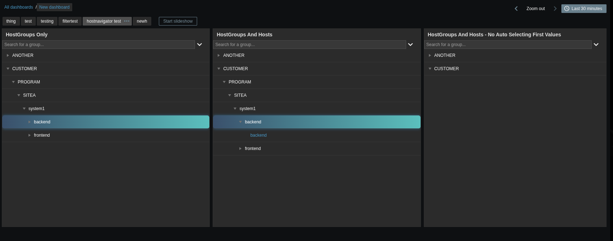
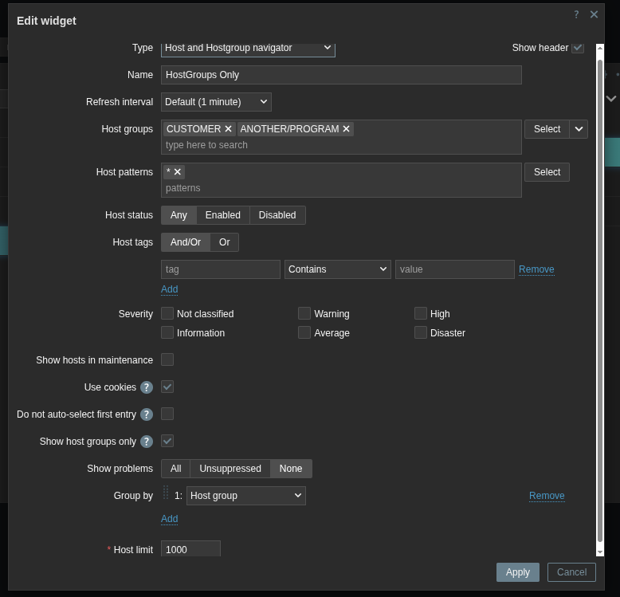
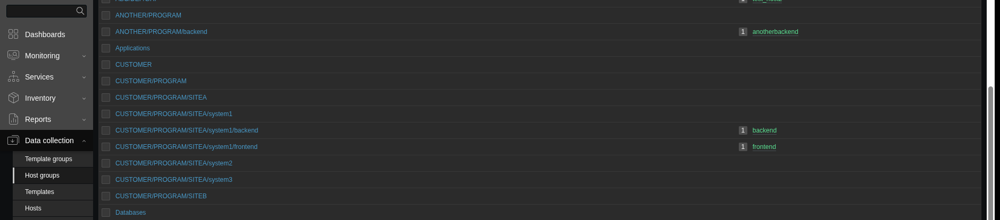

# Zabbix Custom Widget - Host and Hostgroup Navigator
A clone of the Zabbix host navigator widget, but with extended usability features and improved functionality

## Widget Images From Dashboard



## Main Configuration Form



## Data collection -> Host groups configuration for the Dashboard screenshot above




## Required Zabbix version

 - Please clone the repository version that matches your Zabbix version (7.2, 7.4, etc..)

## Purpose

- This widget is intended to add many improvements to the default [hostnavigator](https://www.zabbix.com/documentation/current/en/manual/web_interface/frontend_sections/dashboards/widgets/host_navigator) widget written by Zabbix. It is intended to improve the usability of the Zabbix global dashboards and enable increased user interaction. However, the interest in writing this was because of managing several hundred host groups with thousands of hosts. Global dashboards quickly became very difficult to navigate with so many host groups. So, I needed to find ways to more ways to navigate through the many systems. Additionally, much of the customer base does not care about the single host in many instances. They understand their system by the groups that they belong to, so host group navigation was a critical development feature.

## Authors notes

- This widget was originally cloned from the [hostnavigator](https://www.zabbix.com/documentation/current/en/manual/web_interface/frontend_sections/dashboards/widgets/host_navigator) Zabbix widget.

## Future Development

- At this time, the widget is considered feature complete. I would really like to see what feedback this widget generates from the community because I would always like to improve things if I can.

## Functionality and Features

 - Changes how the 'Group by' 'Host group' selection behaves in the widget. In the default Zabbix widget a host group of "Latvia/Riga/CustomerA" would be presented as is. This widget changes that and will display it as such:

<pre> ``` Latvia └── Riga └── CustomerA ``` </pre>

The reason for this change is because Zabbix' built-in host group hierarchy is very powerful. Meaning, if have a host group of "Latvia/Riga/CustomerA" it's actually very useful to create host groups for "Latvia/Riga" and "Latvia" so that they have their own database identifiers. Why? Because in many places in the UI selecting a parent group will implicitly include all child/nested host groups. 

- This widget adds the ability to select host groups in the navigation tree and broadcast the host group to listening widgets by default. This is useful if you have many customer systems that are comprised of many hosts. You might want to select the whole group, have it broadcast to a table like [this awesome widget](https://github.com/gryan337/zabbix-widgets-table) see all the necessary metrics in a table, and then be able to click the items in the table and broadcast them to a graph widget. This makes for an intuitive layout for users.

- Adds a search box with autocomplete functionality for all of the host groups displayed in the navigation tree. This is useful for when there are many host groups and the navigation tree becomes too large. Additionally, some users know exactly what they are looking for and should just be able to search for the system they want without having to navigate the large navigation tree.

- Adds a checkbox in the configuration to prevent auto-selection of the first host and host group. In version 7.0 this was the default behavior. In 7.2 the developers made it so that if a widget is connected to another widget, the controlling widget would automatically choose the first entry (host, item). This wasn't a change I liked by default. So, in this widget you can turn it off by checkmarking 'Do not auto-select first entry'.

- For 7.2 only...Adds a configuration option to store host and host group selections in a cookie. This is very useful if you have many dashboard pages or dashboards. With the regular host navigator widget each time you refresh the page, go to another page or another dashboad you have to find the host group or host again and click it again. For large setups with many dashboards and systems this can be cumbersome and exhausting to the user. Using the cookie option stores the host or host group you selected. So, if you navigate to another page or dashboard with this widget, and it is also configured to use cookies, it will automatically re-select the host and/or host group you last selected. By default, the checkbox in the configuration form is not selected. You must click the checkbox in every instance of this widget for this feature to fully work. In 7.4 the cookie is set by default and allows for intuitive navigation across dashboard tabs and dashboards while preserving the last selected Host group.

- A configuration option, 'Show host groups only', was added to permit only showing host groups in the widget and no hosts. I personally find this useful because in one widget you can turn this on and have it broadcast to another one of these widgets that is configured to only show the hosts of the broadcasted host group. This makes for an intuitive dashboard flow.

- If the Host groups, Host patterns, and Host tags are all omitted from the configuration form, this widget will display nothing. The use case for this pairs nicely with the 'Show host groups only' configuration mentioned above because you can set one widget to show only host groups and have it broadcast to another that listens for the broadcasted host groups. This makes it feel like you are filtering on the dashboard. The regular host navigator widget by Zabbix just displays all hosts if all values are omitted, and to users and customers this doesn't make sense, especially if they have visibility into many disparate host groups.


## Installation Instructions

 - Clone this repo into the `ui/modules/` folder (standard path is `/usr/share/zabbix/ui/modules/` from RPM installations)
 - Go to Zabbix URL -> Administration -> General -> Modules
 - Select `Scan directory` from the top right of the page
 - Find the `Host and Hostgroup Navigator` widget and enable it on the right

## Known Issues and Things I'd like to polish

- None


# 🚀 Project Roadmap

A high-level view of our project milestones and upcoming goals.

---

## 📍 Q4 2025

- [ ] Add the ability to sort the host list ascendingly or descendingly with a configuration option  

---
